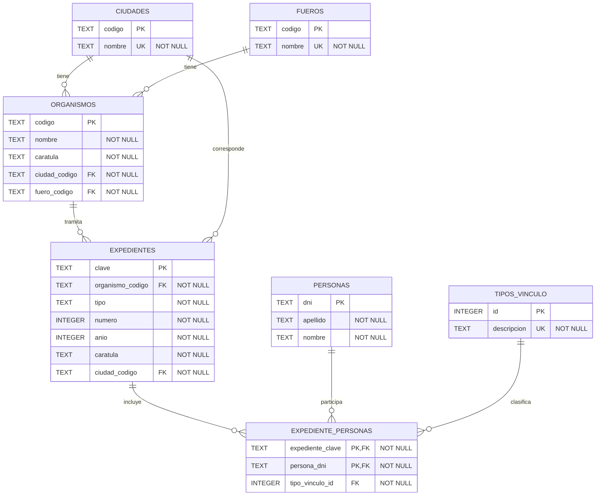

# Mesa de Entradas Virtual

Aplicación web para registrar y administrar expedientes de una Mesa de Entradas Virtual.

El proyecto fue desarrollado como challenge para el concurso de Programador Web del Poder Judicial. Implementa una arquitectura cliente-servidor con backend en Node.js/Express y frontend en React.

## Stack utilizado

### Backend

- Node.js
- TypeScript
- Express
- SQLite
- better-sqlite3

### Frontend

- Vite
- React
- TypeScript
- Ant Design

## Estructura del proyecto

```txt
mesa-entradas-virtual/
  backend/
  frontend/
  docker-compose.yml
  README.md
```

## Requisitos previos

El proyecto puede ejecutarse de dos maneras.

Para ejecución local:

- Node.js
- npm

Para ejecución con Docker:

- Docker
- Docker Compose

Se recomienda usar una versión actual de Node.js si se elige la ejecución local.

---

## Puesta en marcha

Elegir una de las siguientes opciones:

- Opción 1: ejecución local con Node.js y npm.
- Opción 2: ejecución con Docker Compose.

### Opción 1: ejecución local

En una terminal, levantar el backend:

```bash
cd backend
npm install
npm run dev
```

En otra terminal, levantar el frontend:

```bash
cd frontend
npm install
npm run dev
```

Servicios expuestos habitualmente:

- Frontend: `http://localhost:5173`
- Backend: `http://localhost:3000`
- Healthcheck API: `http://localhost:3000/api/health`

### Opción 2: ejecución con Docker

Desde la raíz del proyecto:

```bash
docker compose up --build
```

Servicios expuestos:

- Frontend: `http://localhost:5173`
- Backend: `http://localhost:3000`
- Healthcheck API: `http://localhost:3000/api/health`

Para detener los contenedores:

```bash
docker compose down
```

---

## Backend

El backend expone una API REST.

Por defecto queda disponible en:

```txt
http://localhost:3000
```

La API utiliza el prefijo:

```txt
http://localhost:3000/api
```

Endpoint de verificación:

```txt
GET /api/health
```

Respuesta esperada:

```json
{
  "status": "ok"
}
```

### Puerto del backend

El puerto puede modificarse usando la variable de entorno `PORT`.

Ejemplo:

```bash
PORT=3001 npm run dev
```

En ese caso, también debe configurarse el frontend para apuntar al nuevo puerto mediante `VITE_API_BASE_URL`.

---

## Frontend

El frontend es una aplicación React creada con Vite.

Por defecto queda disponible en:

```txt
http://localhost:5173
```

El frontend consume por defecto la API en:

```txt
http://localhost:3000/api
```

### Variable opcional del frontend

Si el backend corre en otro puerto o en otra URL, crear un archivo `.env` dentro de `frontend/` con:

```env
VITE_API_BASE_URL=http://localhost:3000/api
```

Ejemplo si el backend corre en el puerto `3001`:

```env
VITE_API_BASE_URL=http://localhost:3001/api
```

---

## Base de datos SQLite

El backend utiliza SQLite.

La base se inicializa a partir del archivo `backend/src/database/schema.sql`, que contiene:

- creación de tablas;
- creación de índices;
- carga inicial de catálogos;
- datos de prueba.

Los datos de prueba incluidos permiten validar los flujos principales de la aplicación y las estadísticas.

Incluyen:

- 3 ciudades;
- 4 fueros;
- 4 tipos de vínculo;
- 8 organismos;
- 12 personas;
- 15 expedientes;
- vínculos entre expedientes y personas.

### Reinicializar la base de datos en ejecución local

Si se desea regenerar la base desde cero con los datos de prueba, eliminar el archivo SQLite local generado por el backend y volver a iniciar el servidor.

Para localizarlo:

```bash
find backend -name "*.sqlite" -o -name "*.sqlite3" -o -name "*.db"
```

Luego eliminar el archivo encontrado. Por ejemplo:

```bash
rm backend/data/database.sqlite
```

Después volver a levantar el backend:

```bash
cd backend
npm run dev
```

Al iniciar nuevamente, el backend vuelve a crear la base y carga los datos definidos en `schema.sql`.

### Base de datos en Docker

Cuando la aplicación se ejecuta con Docker Compose, la base SQLite del backend se persiste en un volumen llamado `backend_data`.

Esto permite conservar los datos entre reinicios de contenedores.

Para reinicializar la base en Docker y volver a cargar los datos definidos en `schema.sql`, eliminar el volumen y volver a construir:

```bash
docker compose down -v
docker compose up --build
```

---

## Modelo de datos

El siguiente diagrama resume las entidades principales y sus relaciones.

<details>
<summary>Ver diagrama del modelo de datos</summary>



</details>

---

## Comandos útiles

### Backend

Desde la carpeta `backend`:

```bash
npm run dev
```

Compilar TypeScript:

```bash
npm run build
```

Ejecutar la versión compilada:

```bash
npm start
```

Ejecutar linter:

```bash
npm run lint
```

Formatear código:

```bash
npm run format
```

### Frontend

Desde la carpeta `frontend`:

```bash
npm run dev
```

Compilar frontend:

```bash
npm run build
```

Previsualizar build de producción:

```bash
npm run preview
```

Ejecutar linter:

```bash
npm run lint
```

---

## Funcionalidades implementadas

### Expedientes

- Alta de expedientes.
- Listado de expedientes.
- Edición de carátula/título del expediente.
- Generación de clave con formato:

```txt
ORG TIPO NRO/AÑO
```

Ejemplo:

```txt
JNQFA EXP 1/2026
```

- Restricción para evitar expedientes duplicados con la misma combinación de organismo, tipo, número y año.
- Validación de coherencia entre organismo y ciudad del expediente.

### Personas asociadas a expedientes

- Registro de expediente con actor principal obligatorio.

- Asociación de varias personas a un expediente.

- Tipos de vínculo disponibles:
  - ACTOR
  - DEMANDADO
  - CONDENADO
  - VICTIMA

- Listado de personas asociadas a un expediente.

- Edición de personas asociadas a un expediente.

- Alta de nueva persona vinculada a un expediente existente.

- Baja de persona vinculada a un expediente existente.

- Modificación del vínculo de una persona asociada.

- Cambio de actor principal.

- Restricción para que un expediente tenga exactamente un actor principal.

- Restricción para que una persona no esté repetida dentro del mismo expediente.

### Personas

- Alta de personas.
- Listado de personas.
- Edición de personas.
- Consulta de expedientes asociados a una persona, incluyendo el vínculo correspondiente.

### Organismos

- Alta de organismos.
- Listado de organismos.
- Edición de organismos.
- Eliminación de organismos.
- Validación del formato del código de organismo.
- Validación para evitar eliminar organismos que ya tienen expedientes asociados.

El código de organismo sigue el formato:

```txt
J<CIUDAD><FUERO>
```

Ejemplos:

```txt
JNQFA
JZACI
JJUEJ
```

Donde:

- `J` identifica organismo judicial;
- `NQ`, `ZA`, `JU` identifican ciudad;
- `FA`, `CI`, `LA`, `EJ` identifican fuero.

### Estadísticas

- Estadísticas de expedientes por año.
- Estadísticas de expedientes por ciudad.
- Estadísticas de expedientes por fuero.
- Visualización en tablas desde el frontend.

---

## Endpoints principales

### Health check

```txt
GET /api/health
```

### Personas

```txt
GET /api/personas
POST /api/personas
PATCH /api/personas/:dni
GET /api/personas/:dni/expedientes
```

### Organismos

```txt
GET /api/organismos
POST /api/organismos
PUT /api/organismos/:codigo
DELETE /api/organismos/:codigo
```

### Expedientes

```txt
GET /api/expedientes
POST /api/expedientes
PATCH /api/expedientes/:clave
GET /api/expedientes/:clave/personas
PATCH /api/expedientes/:clave/personas
```

Importante: como la clave del expediente contiene espacios y `/`, desde clientes HTTP debe enviarse codificada en la URL.

Ejemplo en frontend:

```ts
encodeURIComponent(clave);
```

### Estadísticas

```txt
GET /api/estadisticas
```

---

## Decisiones de diseño

### Arquitectura cliente-servidor

Se separó el frontend del backend para mantener responsabilidades claras:

- el backend expone una API REST;
- el frontend consume esa API y resuelve la interacción con el usuario.

Ambos proyectos viven en el mismo repositorio para simplificar la entrega y la puesta en marcha.

### Organización del backend

El backend se organizó en capas simples:

```txt
routes       → definición de endpoints
controllers  → manejo de request/response
validations  → validación de entrada
services     → reglas de negocio
repositories → acceso a SQLite
domain       → tipos y funciones del dominio
```

La intención fue mantener una estructura clara sin sobrediseñar.

### Validaciones

Se separaron dos tipos de validación:

1. Validaciones de entrada:
   - forma del body;
   - campos obligatorios;
   - tipos correctos;
   - strings no vacíos;
   - números válidos.

2. Validaciones de negocio:
   - existencia de expediente;
   - existencia de personas;
   - existencia de tipos de vínculo;
   - coherencia entre organismo y ciudad;
   - actor principal obligatorio;
   - un único actor principal por expediente;
   - persona no repetida dentro del mismo expediente.

### SQLite

Se utilizó SQLite por practicidad para el challenge y porque el dominio requería relaciones entre entidades.

El modelo incluye claves foráneas e índices para reforzar reglas importantes.

### Catálogos

Las ciudades, fueros y tipos de vínculo se modelaron como tablas de catálogo.

Esto evita depender de strings sueltos en la lógica de negocio y permite validar datos contra la base.

### Relación expediente-persona

La relación entre expedientes y personas se modeló como muchos a muchos mediante la tabla:

```txt
expediente_personas
```

Esa tabla guarda:

- expediente;
- persona;
- tipo de vínculo.

### Actor principal

La regla de que un expediente debe tener un único actor principal se refuerza en dos lugares:

- en el service, mediante validaciones de negocio;
- en SQLite, mediante un índice único parcial sobre `expediente_personas`.

### Edición de personas asociadas

La edición de personas asociadas a un expediente se implementó como reemplazo completo de la lista de vínculos.

Esto permite resolver con una sola operación:

- agregar personas;
- quitar personas;
- cambiar vínculos;
- cambiar actor principal.

La operación se realiza dentro de una transacción.

### Edición de expediente

La clave del expediente no se modifica una vez creado.

La clave identifica al expediente, por lo que modificar organismo, tipo, número o año implicaría cambiar su identidad. Por ese motivo se permite editar la carátula/título, pero no la clave.

### Docker

Se agregó una configuración con Docker Compose para permitir levantar frontend y backend desde la raíz del proyecto con un único comando.

La base SQLite del backend se persiste en un volumen Docker para mantener los datos entre reinicios de contenedores.

---

## Dificultades encontradas

### Modelado del actor principal

Una dificultad fue decidir cómo representar al actor principal.

Se resolvió modelarlo como una persona asociada al expediente con tipo de vínculo `ACTOR`, en lugar de guardarlo como un campo separado en la tabla `expedientes`.

Esto permitió mantener un único modelo de vínculos entre personas y expedientes.

### Garantizar un único actor

Otra dificultad fue garantizar que un expediente no tuviera más de un actor principal.

Se resolvió con validaciones en la capa de service y con un índice único parcial en SQLite.

### Edición de personas asociadas

La edición posterior de personas asociadas requería cubrir altas, bajas y modificaciones de vínculos.

Se resolvió con un endpoint específico:

```txt
PATCH /api/expedientes/:clave/personas
```

Este endpoint reemplaza la composición completa de personas asociadas al expediente dentro de una transacción.

### Clave del expediente en URL

La clave del expediente contiene espacios y una barra `/`, por ejemplo:

```txt
JNQFA EXP 1/2026
```

Esto requiere codificar la clave al enviarla por URL.

En el frontend se utiliza:

```ts
encodeURIComponent(clave);
```

### Eliminación de organismos con expedientes asociados

La eliminación de organismos requiere validar si existen expedientes asociados.

Si el organismo ya está referenciado por expedientes, la API responde con un error de conflicto y no permite la eliminación.

---

## Alcance y limitaciones

- No se implementó baja física de expedientes.
- No se implementó baja física de personas.
- La gestión de personas dentro de un expediente sí permite quitar vínculos, lo que cubre la baja de una persona asociada a un expediente.
- La clave del expediente no se modifica luego de la creación.
- La aplicación no incluye autenticación, ya que no fue requerida para el challenge.
- La aplicación no incluye paginación backend; el listado se resuelve con carga completa y filtrado local en frontend.
- La base SQLite se utiliza localmente para simplificar la puesta en marcha.
- En Docker, la base SQLite se persiste mediante un volumen.
